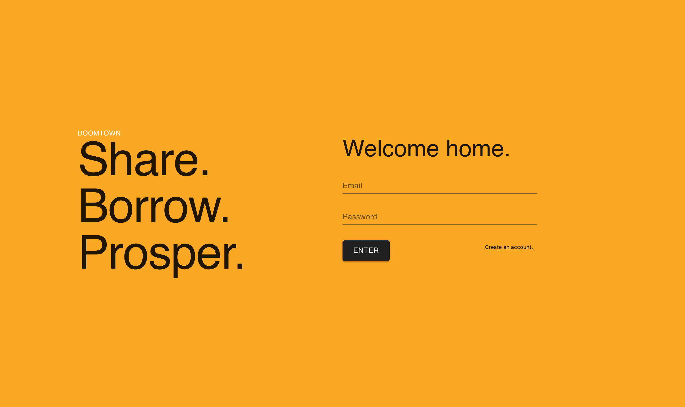
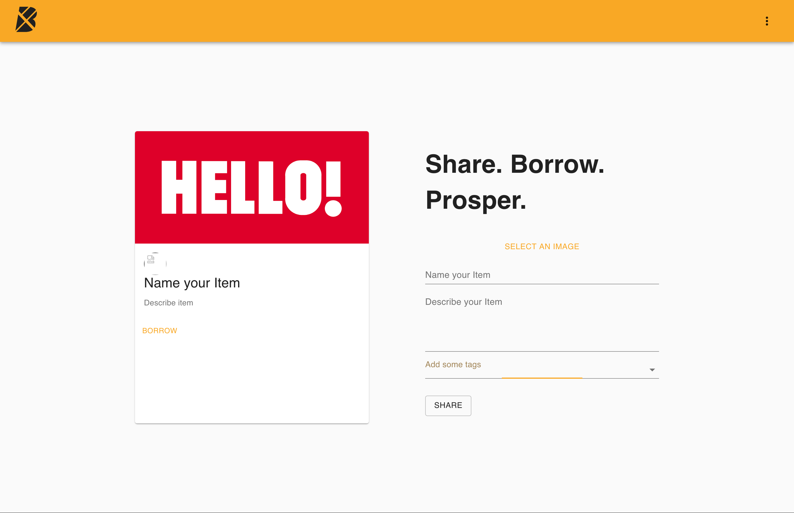

# Boomtown 🏙

Full-stack React application where users share and borrow card items from other users

## Screenshots




## Technologies used

- React
- GraphQL/Apollo
- Material UI
- Postgres
- Node

## Server

Commands must be run from the `server` directory:

### Installation

```bash
yarn install
```

### Run

```bash
yarn start
```

## Client

Commands must be run from the `client` directory:

### Installation

```bash
yarn install
```

### Run

```bash
yarn start
```

### Build

```bash
yarn run build
```
